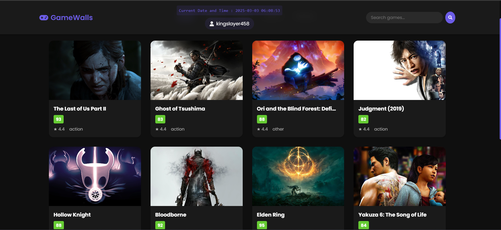
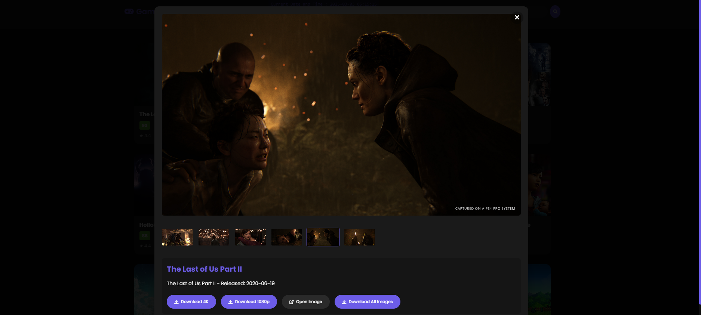

# Game-walls-using-RAWG-API
## DOWNLOAD BUTTON NOT WORKING AND WILL BE FIXED SOON
# 🎮 GameWalls - Game Wallpapers Hub

A modern, responsive web application for browsing and downloading high-quality video game wallpapers.



## ✨ Features

- **Responsive Design**: Looks great on all devices from mobile to desktop
- **Category Filtering**: Browse wallpapers by game genres (Action, RPG, Sports, Racing)
- **User Accounts**: Personal favorites and download history
- **Search Functionality**: Find wallpapers from your favorite games
- **Interactive UI**: Smooth transitions and animations for a modern feel
- **Pagination**: Browse through large collections without performance issues
- **Real-time Updates**: Current date and time display

## 🎬 Demo
🚀 **Live Demo:** [Game-walls-using-RAWG-API](https://kingslayer458.github.io/Game-walls-using-RAWG-API/)




### Animations
- Smooth card hover effects with scale and shadow transitions
- Fade-in animations when loading new wallpaper batches
- Modal transitions for wallpaper detail view
- Loading spinner animation during data fetching

## 🛠️ Tech Stack

- HTML5, CSS3, JavaScript (Vanilla)
- Font Awesome for icons
- Google Fonts (Poppins)
- Responsive CSS Grid & Flexbox layout

## 📋 Project Structure

```
Game-walls-using-RAWG-API/
├── index.html         # Main HTML structure
├── styles.css         # Styling and animations
├── script.js          # Application logic
├── config.js          # Configuration variables
└── README.md          # Project documentation
```

## 🚀 Getting Started

1. Clone the repository:
   ```bash
   git clone[https://github.com/kingslayer458/Game-walls-using-RAWG-API.git]
   ```

2. Navigate to the project directory:
   ```bash
   cd Game-walls-using-RAWG-API
   ```

3. Open `index.html` in your browser or use a local server
   
## 🤝 Contributing

Contributions are welcome! Please feel free to submit a Pull Request.

1. Fork the repository
2. Create your feature branch (`git checkout -b feature/amazing-feature`)
3. Commit your changes (`git commit -m 'Add some amazing feature'`)
4. Push to the branch (`git push origin feature/amazing-feature`)
5. Open a Pull Request

## 📜 License

This project is licensed under the MIT License - see the LICENSE file for details.


Project Link: [https://github.com/kingslayer458/Game-walls-using-RAWG-API](https://github.com/kingslayer458/Game-walls-using-RAWG-API)

---

Made with ❤️ by [C MANOJ KUMAR](https://github.com/kingslayer458)
